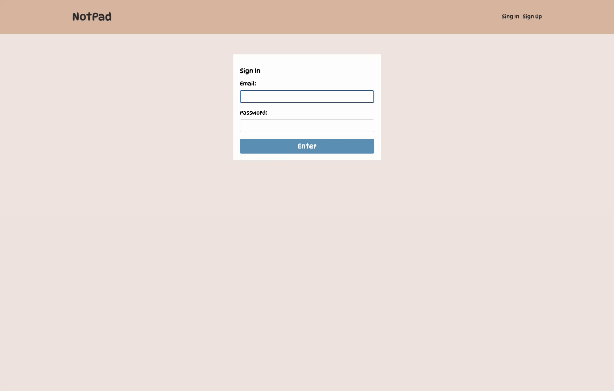

# notePad

This is a simple note-taking application where users can sign up, log in, and manage their notes. Once logged in, users can add, view, and delete notes. The application allows users to securely store their notes, making it a useful tool for personal note-taking.

## Features

- User authentication (sign up & sign in)
- Add new notes
- View and delete notes
- Secure user data with encrypted passwords
- Protected API routes using JWT
- Form validation to ensure proper input

## Tech Stack

- React Router Dom
- Express
- Nodemon
- Dotenv
- Mongoose
- Bcrypt
- Cors
- JsonWebToken
- Validator

